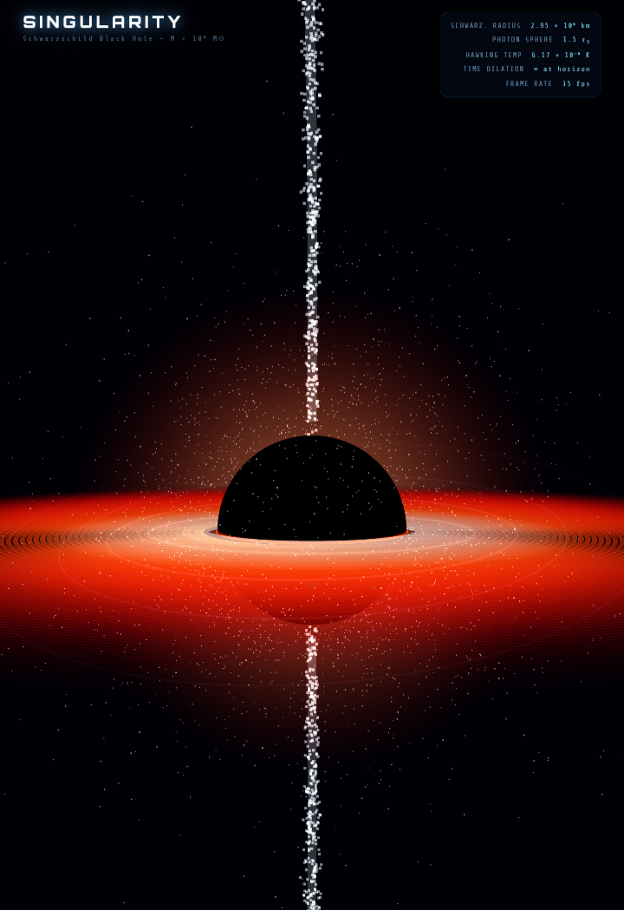

# Black Hole Singularity Simulator

**A visually stunning, real-time 3D simulation of a Schwarzschild black hole with relativistic effects.**



## ✨ Live Demo

[**Open Black Hole Simulator**](https://nazat02.github.io/Blackhole-/)

---

## 🌟 Features

- Realistic Schwarzschild black hole with event horizon
- Temperature-colored accretion disk with Doppler effect
- Gravitational lensing (Einstein rings)
- Relativistic jets and Hawking radiation particles
- Warped 3D spacetime curvature grid
- Interactive scientific controls

---

## 🚀 Getting Started

1. **Clone the repository**
   ```bash
   git clone https://github.com/nazat02/Blackhole-.git
